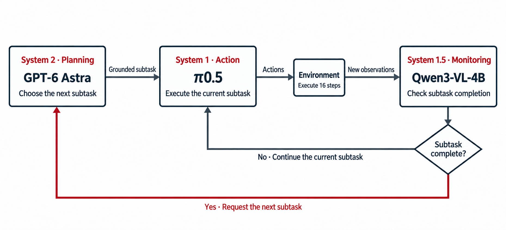

<div align="center">

# Astra on RoboMME

**A three-tier system for long-horizon robotic manipulation**

Plan with **GPT-6 Astra** · Monitor with **Qwen3-VL** · Act with **π0.5**

[](https://bingaochen.github.io/Astra-on-RoboMME/)
[](https://robomme.github.io/)
[](https://huggingface.co/bingaochen/Astra-on-RoboMME-Monitor)
[](LICENSE)

[**Method**](#method) · [**Results**](#results) · [**Getting started**](#getting-started) · [**Evaluation guide**](docs/evaluation.md)

</div>

A robot needs to decide **what to do next**, execute it, and recognize **when it
is done**. Astra on RoboMME separates these jobs: a strong visual reasoning model
plans grounded subtasks, a pretrained VLA executes them, and a small learned
monitor checks completion to determine when to request the next plan.

This repository provides the code, task prompts and model references needed
to evaluate the system on RoboMME.

## Method



| Tier | Model | Responsibility |
|---|---|---|
| **System 2 · Planning** | GPT-6 Astra | Uses task instructions, observations and task-specific visual history to choose the next grounded subtask. |
| **System 1 · Action** | Fine-tuned π0.5 / MME-VLA | Turns the current subtask into low-level robot actions. |
| **System 1.5 · Monitoring** | Qwen3-VL-4B + trained LoRA | Checks progress and determines when to request a new plan. |

The three components form a closed loop: the VLA continues executing the current
subtask until the monitor signals completion, then Astra plans the next subtask.

## Results

**79.13% success on 800 official RoboMME test episodes** — 633 success, 103 fail,
64 timeout; 16 tasks with 50 episodes each.

| Counting | Permanence | Reference | Imitation | Overall |
|:---:|:---:|:---:|:---:|:---:|
| 69.50% | 94.00% | 92.00% | 61.00% | **79.13%** |

See the [per-task results](docs/results/test-per-task.csv) and
[evaluation notes](docs/results/README.md) for the recorded setup and accounting.
The reported run used Codex; the reproduction guide provides a Responses API runner.

## Getting started

### 1. Install and download the models

Follow the [installation and evaluation guide](docs/evaluation.md) to set up the
Python environments, download the VLA and monitor checkpoints, and configure your
API credential. The runner requires **Linux, NVIDIA GPUs and two GPUs per worker**.
The trained monitor is available on
[Hugging Face](https://huggingface.co/bingaochen/Astra-on-RoboMME-Monitor).

### 2. Run the evaluation

After completing setup and the guide's validation smoke check, run all 800 test
episodes from the repository root:

```bash
"$SIM_PYTHON" examples/champ/prepare_cases.py --dataset test \
  --output runs/test-cases
VLA_GPU=0 MONITOR_GPU=1 PORT=18762 \
  bash examples/champ/run.sh runs/test-cases/all.json runs/test-001
```

Use a new output directory for each run. Inference makes paid API requests.

### 3. Read the results

The run writes its results to `runs/test-001/summary.json`, with per-episode
records under `runs/test-001/results/`. See the
[evaluation guide](docs/evaluation.md) for parallel execution and result aggregation.

## Acknowledgments

The action policy and supporting code build on
[RoboMME / MME-VLA](https://github.com/RoboMME/robomme_policy_learning) and
[OpenPI](https://github.com/Physical-Intelligence/openpi); the completion monitor
uses [Qwen3-VL](https://huggingface.co/Qwen/Qwen3-VL-4B-Instruct).
We thank their authors for the benchmark, pretrained models and open-source code.
